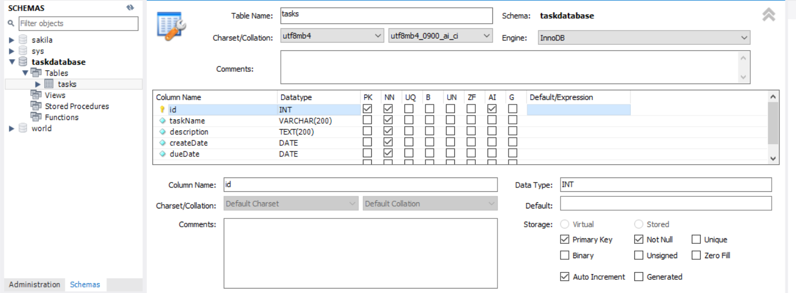
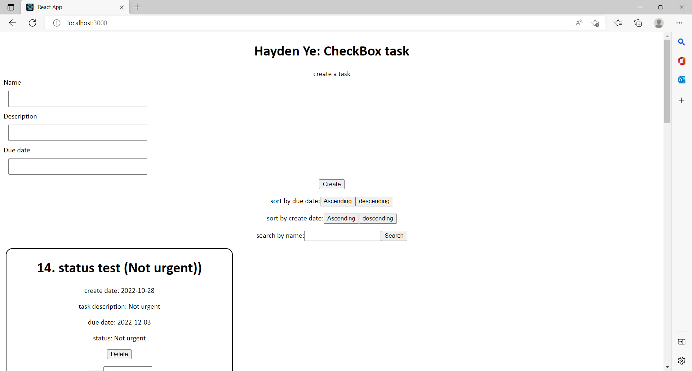
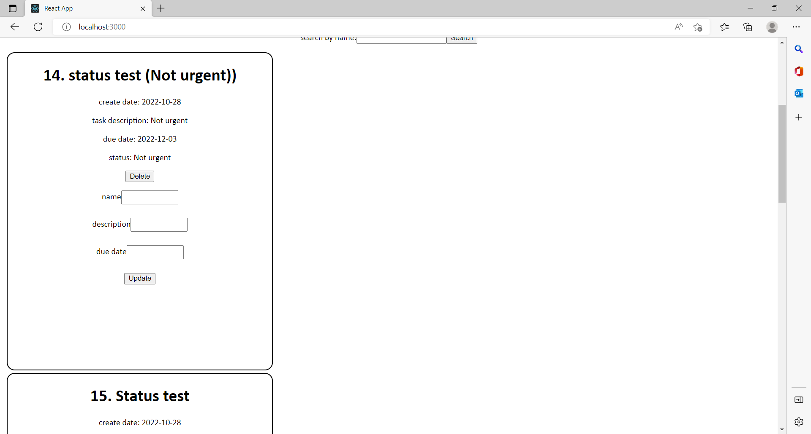

# CheckBoxTask
A simple taskboard allowing the user to set up tasks and view tasklist, edit, sort and search.

-	User should be able to create a new task, including the following fields (Required)
o	Name
o	Description
o	Due date
-	User should be able to view all tasks created in a list view, showing all the following details (Required)
o	Name
o	Description
o	Due date
o	Create date
o	Status
	Not urgent
	Due soon (Due date is within 7 days)
	Overdue
-	User should be able to edit task name, description and due date (Required)
-	User should be able to sort by due date or create date (Should have)
-	User should be able to search based on task name (Should have)

need to address the key risk of large volume of task creation within 10s of 1000s.

development operation process:
database:
run mysql workbench
go to server index.js
change the host,user,password,database into correct setting of database workbench
const db = mysql.createPool({
    host: "localhost",
    user: "root",
    password: "password",
    database: "taskdatabase",
});

The database should have the following columns and settings\
**id** : INT, the id number of data node (row), primary key, not null, auto increment\
**taskName**: VARCHAR(200), not null\
**description**: TEXT(200), not null\
**createDate**: DATE, not null\
**dueDate**: DATE, not null\

**frontend**:
go to **client** folder, run:
    `npm start`

    create task:
        input the information and click "create" button to create task
        the date follows the format of YYYY-MM-DD
    When updating the information:
        go to the task card, input information and click "update" button
        If you don't want to change one of the information, just leave that textbox empty as empty textbox will not change the task information. eg. original task name is "Name", edit box is "", after clicking update, the task name is still "Name"
    Delete the task card:
        go to task card, click the "delete" button
    Sort:
        Ascending: listing from top to bottom, from earliest date to latest date
        Descending: listing from top to bottom, from latest date to earliest date
    Search:
        input the taskName and click "Search" button"
        if there's multiple tasks with same name, it will return a list of all the tasks with that name
        Searched results also support the sorting feature

**backend**:
split terminal/open new terminal, go to **server** folder, run:
    `npm run devStart`

the front end webpage http://localhost:3000/ should looks like

**risks**:
The high volume task creation will generate the risk of overflow in stack memory. For this risk, I decide to make the task creation dirrectly interact with the backend database. \
Once submit a task or delete a task, instead of adding a mirror node in frontend tasklist, the client's web page is refreshed to syncronize with database dirrectly. Because considering the multi-user case, previous method may assign wrong task id to frontend task mirror.\
Meanwhile, the high volume user interaction will decrease the backend's operation speed, therefore, the sorting can be done in the frontend's display list (client's machine). Searching can also be done in frontend tasklist, but I want it to get up-to-date response with database.\
Further improvements on this issue would be getting and displaying the task lists page by page, getting task rows from database from id 1~20, 20~40 etc each time, at each page.\

**Functionality improvements**
We should add authentication and verification feature to improve the safety of system, such as encoded user-id, passwords and login token.\
We can merge the sorting button, one button for due date sorting, another for create date sorting. Clicking will toggle the sorting order between ascending and descending, the picture/words for sorting button should be toggled too.\
We can and should re-pattern the frontend page to make it tidier and nicer.\
We can move the editing feature into a pop-up window, "edit" button -> pop-up input-boxes -> "submit" button. This design will make the web-page cleaner. This can also be done to the create feature.\
We can make the task card's size auto-fitting its content.\
We can make the task description into a fix-sized textbox which can scroll up and down.\
We can make the date input by a drop-down selection box so that there's no explicit format requirement, so that it is easier to use.\
We add a filter feature, which filters the tasks by status, created before/after etc.\
Keyword searching would be a good way for searching tasks, which search keywords in description.\
We can add notification feature, notifying by e-mail or web-message.\
We can add "assign" feature to assign certain task to different user.\

